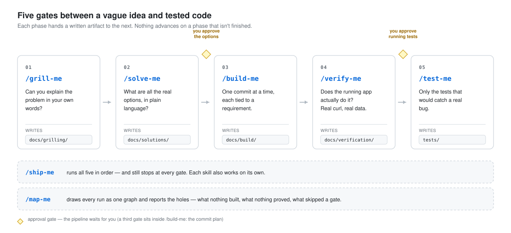

# ship-me

A comprehension-first workflow for [Claude Code](https://claude.com/claude-code).

Most AI coding failures aren't coding failures. They're comprehension failures —
you didn't fully understand the problem, the model filled the gap with something
plausible, and you found out three commits later.

These six skills put a gate in front of every step where that can happen.

<picture>
  <source media="(prefers-color-scheme: dark)" srcset="assets/pipeline-dark.svg">
  
</picture>

You stay in control at every gate. The skills are deliberately hard to
steamroll: `/grill-me` won't advance until you can answer, `/build-me` won't
write code until you approve the commit plan, and `/verify-me` refuses to write
tests or start the next phase on its own.

## Install

```bash
git clone https://github.com/Kerliula/ship-me.git
cd ship-me && ./install.sh
```

That symlinks the skills into `~/.claude/skills/`, so `git pull` updates them.
Use `--copy` for real copies, or `--project <path>` to install into a single
project's `.claude/skills/` instead.

Restart Claude Code, then:

```
/grill-me the export endpoint times out on large accounts
```

## The skills

| Skill | What it does | Writes |
|---|---|---|
| `/grill-me` | Interrogates you until you can explain the problem, the constraints, and the consequences yourself. Drafts what's **out of scope** and **how we'd know it works** — the two things developers always leave vague — and makes you confirm or correct them. | `docs/grilling/<slug>.md` |
| `/solve-me` | Breaks the problem into sub-problems. For each, every genuinely different solution that exists — not three fake options — plus one recommendation. No framework or library names allowed, so the design survives a stack change. | `docs/solutions/<slug>.md` |
| `/build-me` | Cuts the work into commits, gets your approval on the plan, then builds one commit at a time. Each commit says which numbered requirement it serves. New logic gets a plain-language comment explaining the *why* — meant to be deleted once you've read it. | `docs/build/<slug>.md` |
| `/verify-me` | Acts like a QA engineer, not a code reviewer. Creates real data, hits the running app with curl — golden path, edge cases, hostile inputs — and logs every request and response. Ends with a list of the tests that are still missing. Writes none of them. | `docs/verification/<slug>.md` |
| `/test-me` | Writes the missing tests, and actively refuses the useless ones: tests that can't fail, that test the framework, or that lock in implementation details. Every test comes with one sentence on the real bug it catches. | test files |
| `/ship-me` | Conductor. Runs the whole pipeline, keeping the interactive phases in your session and spawning the rest fresh. Three approval gates: solution options, commit plan, go-ahead for tests. | — |

Each phase hands its markdown file to the next one, so the reasoning is on disk
and reviewable instead of buried in a chat log. Each skill is also usable on its
own — `/grill-me` alone is worth it for anything you don't fully understand yet.

## See it before you run it

[`examples/export-timeout/`](examples/export-timeout/) carries one feature —
a CSV export that times out on large accounts — through all four written
phases: the interrogation, the option comparison, the approved commit
plan, and the verification run that caught a requirement the code got
wrong. Start there if you want to know what these skills actually hand you.

## Design principles

**Comprehension debt is the real debt.** Speed you borrow by not understanding
the problem gets repaid at 10x during debugging.

**Plain language beats architecture diagrams.** `/solve-me` bans framework names
so you compare *ideas*, not familiarity.

**Nothing advances on a phase that isn't finished.** Every handoff is a real
gate, not a formality.

**A test that can't fail is worse than no test.** It's false confidence with a
green checkmark.

## Stack notes

`/grill-me`, `/solve-me` and `/ship-me` are stack-agnostic.

`/build-me`, `/verify-me` and `/test-me` currently assume a **Laravel/PHP**
project — they reference artisan, Eloquent conventions, and Pest/PHPUnit. They
adapt to other stacks reasonably well, but you'll get the best results on
Laravel. PRs that generalize these are welcome.

## Contributing

Issues and PRs welcome, particularly:

- Generalizing the three Laravel-coupled skills to other stacks
- Real example runs from your own projects (see [`examples/`](examples/))
- Cases where a skill let something through it should have caught

## License

MIT
