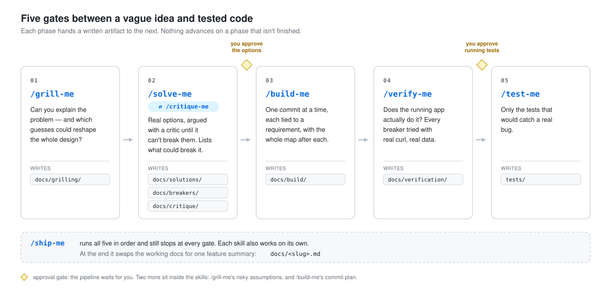

# ship-me

A comprehension-first workflow for [Claude Code](https://claude.com/claude-code).

Most AI coding failures aren't coding failures. They're comprehension failures —
you didn't fully understand the problem, the model filled the gap with something
plausible, and you found out three commits later.

These skills put a gate in front of every step where that can happen.

<picture>
  <source media="(prefers-color-scheme: dark)" srcset="assets/pipeline-dark.svg">
  
</picture>

You stay in control at every gate. The skills are deliberately hard to
steamroll: `/grill-me` won't advance until you can answer — or while an
assumption that could reshape the design is still a guess — `/build-me` won't
write code until you approve the commit plan, and `/verify-me` refuses to write
tests or start the next phase on its own.

## Install

```bash
git clone https://github.com/Kerliula/ship-me.git
cd ship-me && ./install.sh
```

That symlinks the skills into `~/.claude/skills/`, so `git pull` updates them.
Use `--copy` for real copies, or `--project <path>` to install into a single
project's `.claude/skills/` instead.

Restart Claude Code, then:

```
/grill-me the export endpoint times out on large accounts
```

## The skills

| Skill | What it does | Writes |
|---|---|---|
| `/grill-me` | Interrogates you until you can explain the problem, the constraints, and the consequences yourself. Drafts what's **out of scope** and **how we'd know it works** — the two things developers always leave vague — and makes you confirm or correct them. Finds the **load-bearing assumptions**: rates how much of the design each would change if wrong (🔴 🟡 🟢, with a rough %), asks those first, and writes the question to send your project manager when it isn't yours to answer. | `docs/grilling/<slug>.md` |
| `/solve-me` | Breaks the problem into sub-problems. For each, every genuinely different solution that exists — not three fake options — plus one recommendation. No framework or library names allowed, so the design survives a stack change. Also lists every input, data and scenario that could break the design, so `/build-me` handles each one and `/verify-me` tries each one. | `docs/solutions/<slug>.md`, `docs/breakers/<slug>.md` |
| `/critique-me` | Tries to break the solution before you approve it. Checks it against your own answers from `/grill-me`, against how your codebase already solves similar problems, and against the standard ways this kind of problem is solved. Every finding needs evidence. Under `/ship-me` it works in dialogue with `/solve-me`: the solver proposes, the critic tries to break it, the solver fixes or pushes back with evidence, until they agree or you have to decide. | `docs/critique/<slug>.md` |
| `/build-me` | Cuts the work into commits, gets your approval on the plan, then builds one commit at a time. Each commit says which requirement it serves and which breakers it handles — every breaker must land in some commit. Draws a **big-picture diagram** of the tables and files the feature touches, and re-draws it after every commit so you see where it fits. New logic gets a one-line `// WHY:` comment in plain words, meant to be deleted once read. Suggests a clean commit message — no co-author lines or trailers. | `docs/build/<slug>.md` |
| `/verify-me` | Acts like a QA engineer, not a code reviewer. Creates real data, hits the running app with curl — golden path, edge cases, hostile inputs, and every breaker from `/solve-me` — and logs every request and response. Ends with a list of the tests that are still missing. Writes none of them. | `docs/verification/<slug>.md` |
| `/test-me` | Writes the missing tests, and actively refuses the useless ones: tests that can't fail, that test the framework, or that lock in implementation details. Every test comes with one sentence on the real bug it catches. | test files |
| `/ship-me` | Conductor. Runs the whole pipeline, keeping the interactive phases in your session and spawning the rest fresh. Three approval gates: solution options, commit plan, go-ahead for tests. At the end it writes one feature summary and deletes the per-phase working docs. | `docs/<slug>.md` |

Each phase hands its markdown file to the next one, so the reasoning is on disk
and reviewable instead of buried in a chat log. Each skill is also usable on its
own — `/grill-me` alone is worth it for anything you don't fully understand yet.

## Where each phase runs

Invoking a skill doesn't reset your session. It loads instructions into the
conversation you're already in, and context keeps accumulating. What `/ship-me`
does instead is more selective:

| Phase | Runs in |
|---|---|
| `/grill-me` | your session |
| `/solve-me` | **a spawned session** — no memory of yours |
| `/critique-me` | **a spawned session** — separate from `/solve-me`; both stay alive for the dialogue |
| `/build-me` | your session |
| `/verify-me` | **a spawned session** |
| `/test-me` | **a spawned session** |

The split is interactive versus not. `/grill-me` is a dialogue and `/build-me`
stops after every commit for you to review — neither can be spawned, because
you're in the loop. The other four take a file in and write a file out, so
they get a fresh agent with a fully self-contained prompt.

They're spawned so they **can't** see the conversation that produced their
input. If `/solve-me` could read the interrogation, it would inherit your
framing and its own earlier guesses instead of reading the write-up cold. The
file is the interface, and a session with no memory is what proves the file
actually stands on its own.

Run a skill by hand — `/solve-me` typed by you — and nothing is spawned at
all; it runs right where you are.

One consequence worth knowing: your session carries the whole interrogation
*and* every commit review, so it's the long-lived one. That's deliberate —
`/build-me` needs the requirements and the conventions it learned from your
codebase — but it's why the four spawned phases are the cheap ones.

## What you'll see along the way

- **After `/grill-me`:** a table of load-bearing assumptions — what we assume,
  what if not, how much would change — each confirmed by whoever owns it, or
  accepted as a risk in your own words.
- **While the solution is designed:** one line per round of the solve-me ↔
  critique-me dialogue ("Round 2: 2 of 3 fixed, 1 disagreed"). It ends when the
  critic can't break it, when they deadlock, or after 4 rounds — anything
  unsettled comes to you with both sides' position.
- **At the solution gate:** the recommendation and runner-up per sub-problem,
  and every open question, answerable from chat.
- **During the build:** the big-picture diagram after every commit, the
  breakers that commit handled, and the decisions it made that nobody approved.
- **At the end:** one `docs/<slug>.md` — what changed, the decisions and why,
  the final diagram, what could break it and how it's handled, what was
  verified, the tests added. The per-phase working docs are deleted (after you
  say yes), so the commit carries the record, not the scaffolding.

## See it before you run it

[`examples/export-timeout/`](examples/export-timeout/) carries one feature —
a CSV export that times out on large accounts — through all four written
phases: the interrogation, the option comparison, the approved commit
plan, and the verification run that caught a requirement the code got
wrong. Start there if you want to know what these skills actually hand you.
(It predates `/critique-me` and the breakers file, so it doesn't show those
two yet.)

## Design principles

**Comprehension debt is the real debt.** Speed you borrow by not understanding
the problem gets repaid at 10x during debugging.

**Plain language beats framework names.** `/solve-me` bans them so you compare
*ideas*, not familiarity.

**Settle what moves the architecture first.** An assumption that would change
40% of the design if wrong is worth one message to your project manager now,
not a rewrite later.

**A solution nobody tried to break isn't finished.** `/solve-me` lists how it
could fail, and a separate critic argues with it until it holds.

**Nothing advances on a phase that isn't finished.** Every handoff is a real
gate, not a formality.

**A test that can't fail is worse than no test.** It's false confidence with a
green checkmark.

**The file is the interface.** Every phase reads a written artifact, not a
chat log — and the four non-interactive phases run with no memory of your
session, so a write-up that only makes sense in context fails loudly instead
of quietly.

**The decisions nobody approved are the ones that bite.** Every other choice
in this pipeline passes a gate. The ones made mid-commit don't — so
`/build-me` writes them down under `Unplanned:`, where you'll see them.

## Stack notes

`/grill-me`, `/solve-me`, `/critique-me` and `/ship-me` are stack-agnostic.

`/build-me`, `/verify-me` and `/test-me` currently assume a **Laravel/PHP**
project — they reference artisan, Eloquent conventions, and Pest/PHPUnit. They
adapt to other stacks reasonably well, but you'll get the best results on
Laravel. PRs that generalize these are welcome.

## Contributing

Issues and PRs welcome, particularly:

- Generalizing the three Laravel-coupled skills to other stacks
- Real example runs from your own projects (see [`examples/`](examples/))
- Cases where a skill let something through it should have caught

## License

MIT
